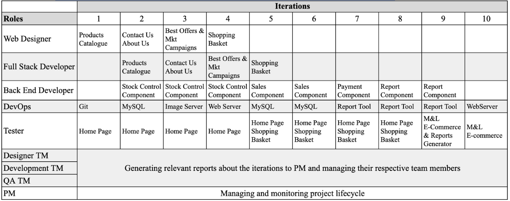
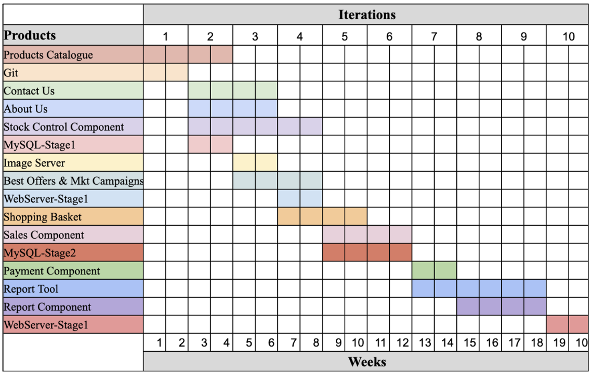
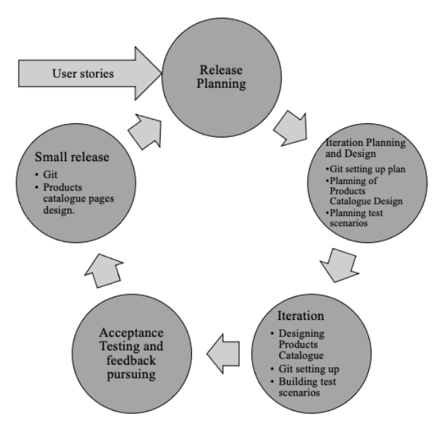

# Outline Project Plan

Regarding the project deadlines, it was suggested by the client no more than 6 months for the finalized e-commerce and 2 months for a version of the website that allows displaying the company’s publicity.
With the suggested deadline in mind, and by analyzing the individual time to build each e-commerce by-product identified by PBS, the plan presented below was prepared.

## Workflow per team member

The table below shows the workflow suggested for developing M&L E-commerce and all employees involved in each activity involved in that endeavour.

## Gantt Chart and Deliverables

The Gantt Chart below illustrates the by-products of M&L E-commerce within the iterations on which they will be built.
It is possible to note that, from iteration number 4 (2 months from the start of the project) the team will have already released a version of the website that contains products catalogue, contact us, and about us pages, such items establish the set Home Page, in which the client will be able to display advertising, as highlighted in the project requirements.

According to the total time spent by all iterations, shown in the table above, the e-commerce will be finished after 20 weeks, which means one month before the initial deadline. This spare month will be reserved for any unforeseen events that may arise during the project.

### Deliverables by Iteration
1. Design of product catalogue pages and source code repositories in conjunction with automation for continuous integration and deployment;
2. Front end source code of product catalogue pages, design of contact us and about us pages, beginning of back end code developing for integrating the website with the stock control system and starting MySQL database configuration;
3. Front end source code of contact us and about us pages, development of back end code of stock control component, image server setting up, designing of best offer and marketing campaigns pages;
4. Delivery of a website version suitable for displaying publicity to users, front end Home page source code and stock control component finalization, designing of shopping cart pages and Web Server setting up;
5. Completion of e-commerce front end, beginning of back end sales component development, which integrates the website with the M&L Sales System, MySQL setting up stage 2;
6. Delivery of the sales component and completion of the MySQL database;
7. Development and delivery of a back end component that integrates e-commerce with the payment system and beginning the configuration of the management reports generator tool (Kibana);
8. Beginning of report component development, which integrates the back end with kibana and continuation of kibana setting up;
9. Finish of kibana setting up and delivery of the report component;
10. Finalization of Web Server setting up and delivery of the final version of M&L E-commerce.

## A proposed XP Iteration

As mentioned in the first session of this project, the software development method chosen to build this proposed e-commerce was XP (eXtreme Programming). According to Don Wells (2013), XP is a method lightweight, highly resilient, and ultimately focused on customer satisfaction. 
This methodology emphasizes the importance of communication both among team members and with the client, as well as works through frequent small releases. Testing is present throughout the entire project execution. In fact, before starting to write the code, developers prepare unit tests to assess their codes as they are being written (Wells, 2013).
The diagram below illustrates how the first iteration of this project will possibly look like:

